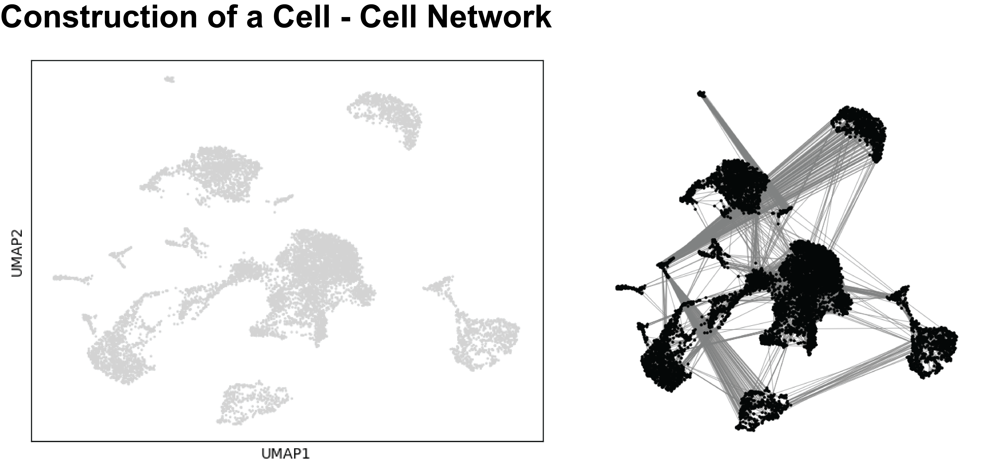
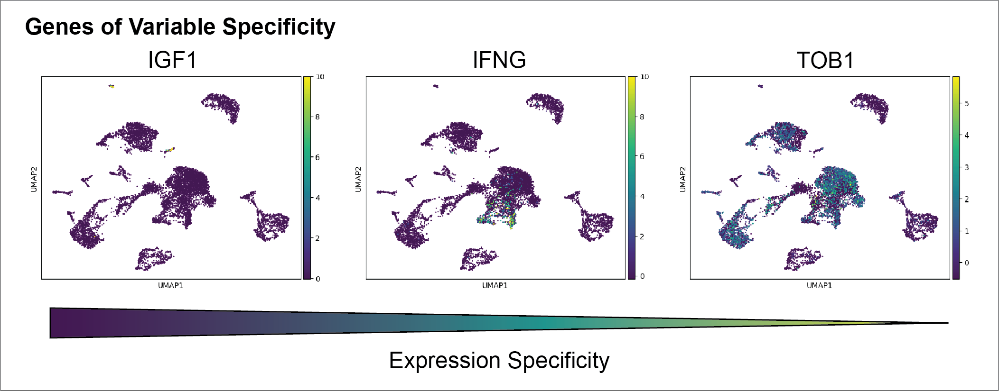
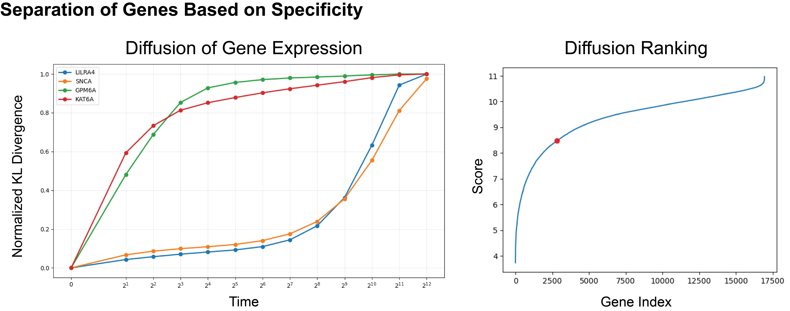
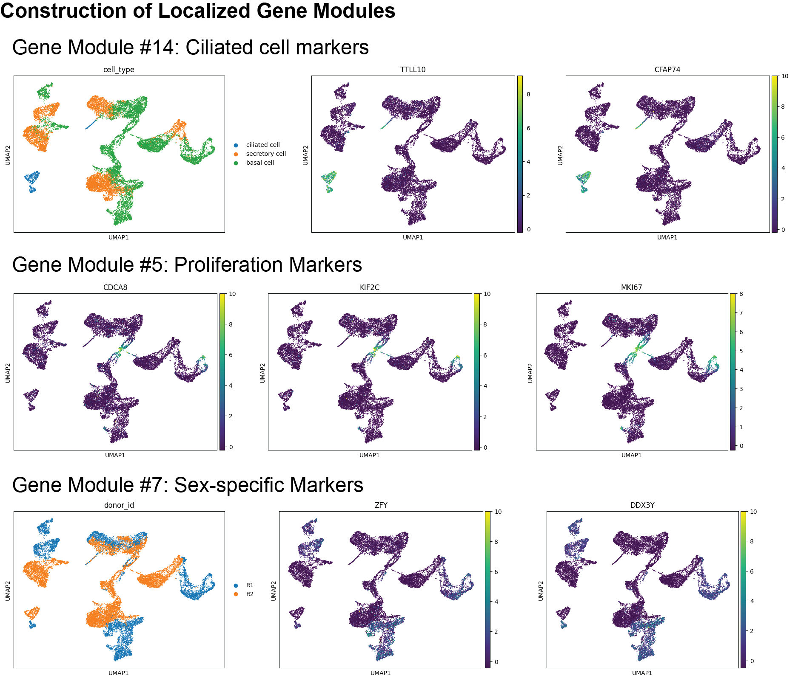

# Welcome to PyLMD!
This package performs Localized Marker Detection (LMD) via Python (with GPU Acceleration). LMD enables the identification of genes that are localized to specific populations of similar cells in scRNA-seq data in a cluster-independent manner. Traditional methods of identifying marker genes rely on clustering of cells (i.e. leiden algorithm) to highlight unique cell populations and then perform differential gene expression analysis. This method, however, is often noisy and leads to high false positives when searching for cell type specific markers. This method also limits the user to grouping cell populations at a single resolution, potentially overlooking small, but critical cell types & states. Lastly, clustering algorithms often miss genes that share expression in multiple clusters, potentially highlighting similarites in function, cell state, or lineage. LMD overcomes these issues by identifying genes whose expression is restricted to particular groups of similar cells and comparing these genes in a cluster-independent manner to identify similarities in expression pattern.

# THIS PROJECT IS A WIP

The inspiration for this project can be found at: https://www.nature.com/articles/s42003-025-08485-y.

To launch in brev.dev, please use the RAPIDS-single cell instance and run: 
apt-get update
apt-get install git
git clone https://github.com/jassonmakkar/pylmd.git
cd pylmd
pip install -e .

If running locally or other cloud service, please ensure that CUDA is functioning (run nvidia-smi & nvcc) prior to installation of GPU version of this package. Then clone the github repo and install:
git clone https://github.com/jassonmakkar/pylmd.git
cd pylmd
pip install -e .

To run in single step:
from pylmd import lmd
LMDs = lmd.pyLMD(path, max_time = max_time, device = 'gpu')

This function first performs preprocessing of the h5 / h5ad file and builds a UMAP. This object is then used to build a cell-cell affinity graph to connect similar cells across the network, enabling diffusion across these connections.

Next, it generates diffusion operators to describe the way in which diffusion will occur across the network. Genes that begin diffusely expressed, will rapidly diffuse across the network, while localized genes will take longer to saturate the graph. The following genes highlight the differences in rate of diffusion based on expression pattern. Each diffusion step can be quantified to determine its proximity to network saturation.

Based on this diffusion pattern, genes can be scored and ranked to identify localized and non-localized genes.

<<<<<<< HEAD
When looking at another sample dataset with various cell types and sample sources, we can utilize LMD to gene modules that highlight cell types, similar cell states across cell types, and sample-specific characteristics.
=======
When looking at another sample dataset with various cell types and sample sources, LMD can be utilized to construct gene modules that highlight cell type specific markers, similar cell states across cell types, and sample-specific characteristics.
>>>>>>> 7ef4ad0a560731a55cd0da37db049c2966ccbf50

